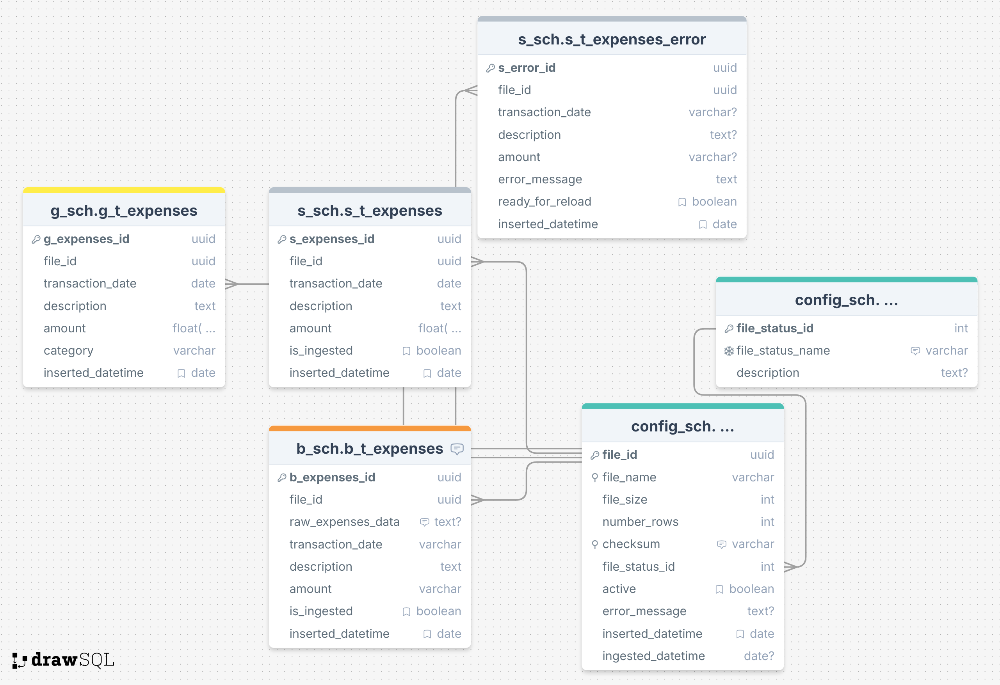

# Expense Ingestion System Design Document

## 1. Overview

This document outlines the design for a web-based system to **upload, validate, and process monthly expense CSV statements** using the **Medallion Architecture**. The system ensures robust **data ingestion, validation, logging, and reprocessing capabilities**, with integration to **Google Drive for storage**.

---

## 2. Key Features

### Web UI (Streamlit-Based)

- **Drag-and-Drop CSV Upload** (Supports Multiple Files)
- **File Status Dashboard** (Uploaded, Processing, Completed, Failed)

---

## 3. Ingestion Pipeline (Medallion Architecture)

### Bronze Layer (Raw Data Storage)

- **Stores original CSVs in Google Drive**.
- **Logs metadata** (file name, size, status, active, checksum, row count, timestamps).
- **Prevents duplicate processing** using **checksum-based reload logic**.
- **Triggers ingestion pipeline asynchronously** (Celery).

### Silver Layer (Validated & Clean Data)

- **Cleans & standardizes data** (Formats dates, trims spaces, etc.).
- **Stores only valid rows**.
- **Failed rows go to a separate error table.**

### Gold Layer (Final Processed Data)

- **Moves enriched data from Silver → Gold for reporting.**.
- **Sends email notification to the user upon completion.**

---

## 4. Error Handling & Reprocessing

### File-Level Failure

- **Scenario:** Entire file fails due to incorrect format, missing columns, or corruption.
- **Solution:**
  - Log the failure in the metadata table.
  - Store error details (e.g., "Missing column: Amount").
  - Send an **email notification** to the user.
  - Allow re-upload of the corrected file. The previous file version is marked as inactive in the files table. A new entry for the reloaded file is added.

### Row-Level Failure

- **Scenario:** Some rows within a file fail validation (e.g., invalid dates, missing values).
- **Solution:**
  - **Store failed rows in a dedicated error table.**
  - Allow users to **edit these rows directly** in the error table.
  - Set corrected rows as **"ready_to_reload"**.
  - The next ingestion cycle **automatically reprocesses these rows**.
  - If successful, the row moves to the Silver Layer and are deleted from error table; otherwise, it stays in the error table with an updated error reason.
